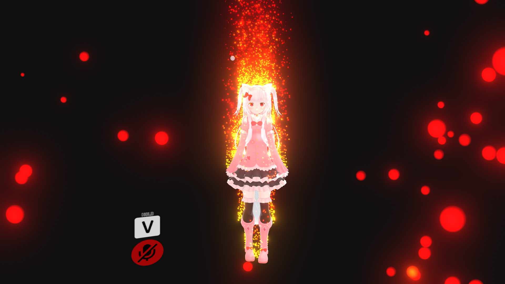
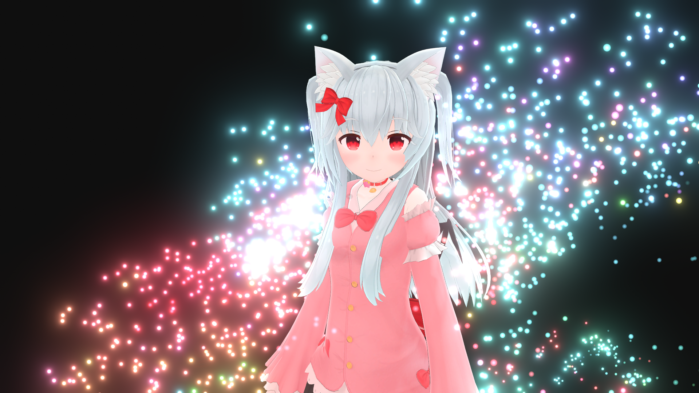

# 説明 (Description)

LegasyパイプラインでVFXGraphのようなパーティクル表現をするためのアセットです。

VRChatのワールドでの動作を確認していますが、アバターでの動作は保証しません。

範囲内のオブジェクト(アバター)からパーティクルが発生します。炎のような表現も可能です。

Asset for expressing particles like VFXGraph in the Legasy pipeline.

We have confirmed the operation of VRChat in the world, but we do not guarantee its operation in avatars.

Particles are generated from objects (or avatars) within the range. Expressions like fire are also possible.

https://youtu.be/jfdF9MAdiX0

# 制作者 (Creator)

ほたてねこまじん🐾
"HOTATE_NEKO"

https://twitter.com/HhotateA_xR

http://hhotatea.com

# 規約 (Terms)

・本アセットはUnity2017.4.28のPCWindowsビルド環境で動作を確認しています。それ以外でのPlatformでの動作は保証しません。

・著作権は製作者に帰属します。

・本アセットを使って発生した問題に対しては製作者は一切の責任を負いません。

・Unityでビルド後であれば連絡なしで再配布可能とします。(VRChatのアバター、ワールドのアップロードはビルドと同じ扱いと考えます)

・ This asset has been confirmed to work on PCWindows build environment of Unity2017.4.28. Operation on other platforms is not guaranteed.

・ Copyright belongs to the "HOTATE_NEKO".

-"HOTATE_NEKO" does not take any responsibility for any problems that occur using this asset.

-After building with Unity, it can be redistributed without contact. (I have confirmed that this is available for the VRChat world. It is unconfirmed whether this can be used for VRChat avatars.)

# 設定 (Configuration)

Lifetime : パーティクルの寿命
ParticleRate : フレーム当たりに生成されるパーティクルの量を変更できます
Motion : 物体の動きを検知する許容値(-0.01で常時発生)
Drag : パーティクルの速度減少(空気抵抗)です
MaxSpeed : パーティクルの最高速度です

StartSpeed : パーティクルの初速です

ParticleForce : パーティクルにかかる力です(風,重力等)
ForceOverLifetime : パーティクルの寿命ごとに力を加えられます

NoiseVelocity : パーティクルの動きにノイズを加えます(カールノイズ)
NoiseOverLifetime : パーティクルの寿命ごとにノイズの大きさを変更できます

ParticleColor : パーティクルの色です(aが低いとパーティクル発生源のオブジェクトの色がブレンドされます)
ColorOverLifetime : パーティクルの寿命ごとに色を変更できます

ParticleSize : パーティクルの大きさです
SizeOverLifetime : パーティクルの寿命ごとに大きさを変更できます

Attraction : パーティクルをControllerに引き寄せます
(AttractorMul,AttractorCenter) : パーティクルを引き寄せる中心をずらす設定です。オブジェクトの位置によって適切に設定してください。

Lifetime: Lifetime of particles
ParticleRate: You can change the amount of particles generated per frame
Motion: Allowance for detecting the movement of an object (always generated at -0.01)
Drag: Particle velocity decrease (air resistance)
MaxSpeed: The maximum speed of the particles

StartSpeed: the initial speed of the particles

ParticleForce: Force applied to particles (wind, gravity, etc.)
ForceOverLifetime: Apply force every particle life

NoiseVelocity: Adds noise to particle movement (curl noise)
NoiseOverLifetime: You can change the amount of noise for each particle life

ParticleColor: the color of the particles (lower a blends the color of the object that generated the particles)
ColorOverLifetime: You can change the color for each particle life

ParticleSize: The size of the particle
SizeOverLifetime: You can change the size of each particle life

Attraction: Attract particles to Controller
(AttractorMul, AttractorCenter): It is a setting to shift the center to attract particles. Set appropriately according to the position of the object.

# 更新履歴 (Change log)

2020/03/03 v1.0
